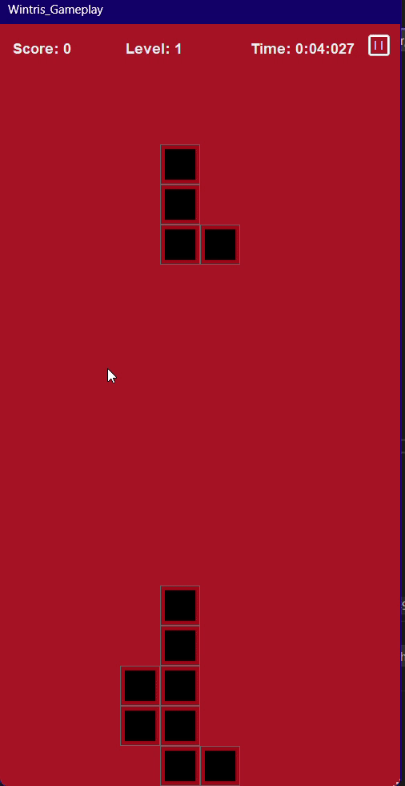

# Lern-Periode 4

**Zeitraum:** *14. Februar bis 4. April*

## Grobplanung

### Wo stehe ich mit meinen Noten?
Im Allgemeinen ist mein **Notenschnitt in Informatik sehr gut**. Ich hatte bisher **keine ungenügenden Noten** und bin **sehr zufrieden** mit meiner bisherigen Leistung.

### Was wäre ein geeignetes Projekt für diese LP4?
Da diese Lernperiode etwas länger ist, habe ich mir überlegt, wieder etwas **anspruchsvolleres zu programmieren**. Da ich außerdem ein Projekt mit **WinForms** umsetzen wollte, habe ich beschlossen, **Tetris in WinForms** zu programmieren. Das Spiel soll ein **ansprechendes GUI** haben und im Großen und Ganzen **wie das Original funktionieren**. Ich denke, das ist grundsätzlich möglich. Obwohl die Umsetzung wahrscheinlich **relativ anspruchsvoll** sein wird, bin ich **bereit, mich dieser Herausforderung zu stellen**.

---

## 14.02.2025: Explorativer Wegwerf-Prototyp

- [x] Mich besser zu **WinForms** informieren
- [ ] Mit verschiedenen **Designs** experimentieren

Heute habe ich mir überlegt, was ich in dieser Lernperiode erreichen möchte. Schon ziemlich bald kam ich zum Schluss, dass ich gerne den Umgang mit **WinForms** lernen möchte. Da die Lernperiode relativ lang ist, wählte ich ein **anspruchsvolles Projekt** und entschied mich, ein **Tetris-Spiel** zu entwickeln.

Da ich bisher kaum Erfahrung mit WinForms hatte, sah ich mir zunächst **Tutorials und Erklärvideos** auf YouTube an, um die **API besser zu verstehen**. Mit dem zweiten Arbeitspaket konnte ich aus Zeitgründen heute nicht mehr viel anfangen.

---

## 21.02.2025: Explorativer Wegwerf-Prototyp

- [x] Skizze für das **GUI-Design**
- [x] **GUI des Hauptmenüs** in WinForms umsetzen
- [x] **Grundfunktionen** implementieren (z. B. Start-Knopf, Titelmusik)
- [x] **Bugfixing**

Ich begann damit, ein passendes **GUI** zu entwerfen. Das Spiel sollte sich am Original orientieren, jedoch mit **roter Farbgebung**. Der Name "**Wintris**" kam mir beim Designen in den Sinn.

Ich gestaltete in **Canva** ein Hintergrundbild, fügte es in eine **PictureBox** ein und erstellte zwei Buttons: einen zum Starten des Spiels, einen für die **Einstellungen**. Bei Klick auf „Start“ wird das Hauptmenü geschlossen und ein neues **Gameplay-Form** geöffnet.

Die Formen stellte ich mit mehreren **PictureBoxen** dar. Die Bewegung implementierte ich, indem ich deren **.Top**- und **.Left**-Eigenschaften änderte. Um mehrere PictureBoxen gleichzeitig zu bewegen, verwendete ich **Listen**. Mithilfe von **ChatGPT** konnte ich das erfolgreich umsetzen.

---

## 28.02.2025: Kern-Funktionalität

- [x] Restliche **Tetris-Formen** einfügen
- [x] Seitwärtsbewegung bei **Tastendruck**
- [x] **Gameplay-Design** verbessern
- [x] **Titelmusik** einfügen

Ich ergänzte die fehlenden Formen und programmierte eine zufällige Auswahl per **Random**. Danach schrieb ich die **automatische Fallbewegung** sowie die **Seitwärtsbewegung** per **Pfeiltasten**. Dann verschönerte ich das Spiel mit **eigenen Blockdesigns**.

Ich installierte das **NuGet-Paket „NAudio“**, um die Titelmusik abzuspielen.

---

## 07.03.2025: Kern-Funktionalität

- [x] **Hitboxen**
- [ ] Automatisches **Löschen voller Zeilen**
- [ ] **Pausierfunktion**
- [ ] Gameplay verschönern

Ich arbeitete an der **Kollisionsabfrage** (Hitbox), indem ich die **Positionen** der Elemente miteinander verglich. Sobald eine Form den Boden berührt, wird sie in ein **Array gespeichert** und eine neue Form erstellt.

Ein Fehler am rechten Rand entstand durch falsche **Fenstergrößen**, den ich durch Anpassung beheben konnte. Danach begann ich mit dem **Rotiermechanismus**, dessen Koordinaten ich zunächst per Hand aufschrieb. Mithilfe von ChatGPT schrieb ich dann die **Rotationsfunktion**. Leider wurde die Position beim Drehen zurückgesetzt – die Fehlerbehebung verschob ich auf die nächste Woche.

---

## 14.03.2025: Architektur ausbauen

- [ ] Rotiermechanismus (korrekt)
- [ ] Pausierfunktion
- [x] Entfernen **voller Zeilen**
- [x] **Punktesystem**

Ich fokussierte mich auf das automatische **Entfernen kompletter Zeilen**, wobei eine **NullReferenceException** auftrat. Nach etwas Debugging konnte ich den Fehler beheben.

Ein anderer Bug führte dazu, dass mehrere Formen gleichzeitig eingefügt wurden. Ursache war ein **Methodenaufruf in einer Schleife**, den ich anschließend korrigierte.

Beim Punktesystem setzte ich ein **Label** ein, das beim Zeilenlöschen **500 Punkte** addiert. Dies werde ich später noch anpassen.

---

## 21.03.2025: Architektur ausbauen

- [x] Verbesserte **Punktelogik**
- [ ] Pausierfunktion
- [ ] Weitere **Soundeffekte**
- [x] Korrigierter **Rotiermechanismus**

Ich überarbeitete den Rotiermechanismus komplett, prüfte alle **Rotationspositionen** auf Richtigkeit und stellte fest, dass sich Formen am Rand oder bei Kollision falsch verhielten.

Das Punktesystem wurde so geändert, dass der Spieler pro Zeile **10 Punkte** erhält. Bei Erreichen eines durch 100 teilbaren Punktestands wird das **Level erhöht** (Fallgeschwindigkeit steigt). 

Ich baute auch eine **„Soft Drop“-Funktion** ein: Mit der **Pfeil-nach-unten-Taste** fällt die Form schneller. Fehlerhafte Rotationen bei Kollisionen verhindere ich nun mithilfe eines **Bools**, der vorher prüft, ob die Rotation gültig ist.

---

## 28.03.2025: Auspolieren

- [x] **Pausierfunktion**
- [ ] Weitere Soundeffekte
- [ ] **Game Over** mit Menü
- [x] **Loopende Musik**
- [x] **Fehlerbehebungen**

Ich designte ein **Pausenmenü** mit Canva und fügte es ins Spiel ein. Die Buttons („Weiter“, „Einstellungen“, „Zurück ins Hauptmenü“) funktionierten, jedoch blockierten die Pfeiltasten die Steuerung, da der Fokus auf dem Pausier-Button lag. Ich wechselte daher zu **WASD** als Steuerung – damit funktionierte alles.

Für die Musik verwendete ich einen **„Tetris Phonk“-Remix** (auch in Alexanders Version genutzt). Ich fand einen zweiten **loopbaren Soundtrack** fürs Hauptmenü. Ein Problem beim Musik-Stopp blieb jedoch bestehen.

---

## 04.04.2025: Auspolieren & Abschluss

- [x] Fehlerbehebung beim **MusicPlayer**
- [x] **Game Over** implementieren

Ich fügte einen **Bool „stop“** ein, um den Fehler beim Musik-Stoppen zu beheben. Dann designte ich das **Game-Over-Menü** in Canva, fügte es als **PictureBox** ein und baute zwei Buttons: **Restart** und **Spiel verlassen**.

Für „Spiel verlassen“ nutzte ich den vorhandenen Code vom Pausenmenü. Für „Restart“ erstellte ich ein neues **Gameplay-Form** und schloss das alte. 

Zusätzlich überarbeitete ich die **GameTimer-Logik**, ersetzte den **„Settings“-Button** durch einen **„Quit Game“-Button**, der das Programm komplett beendet.

---

## Fertiges Projekt

Bei meinem fertigen Projekt handelt es sich um ein voll **funktionsfähiges** Tetris-Spiel mit dem Namen **„Wintris“**. Wie der Name bereits andeutet, wurde das Spiel mit **Windows Forms (WinForms)** in **C#** entwickelt.

Das Spielprinzip orientiert sich am **Original-Tetris**: Ziel ist es, die fallenden **Tetrominos** so zu platzieren, dass sie eine komplette **horizontale Linie** bilden. Sobald dies gelingt, wird die Linie **gelöscht**, und der Spieler erhält **Punkte**.

Nach Erreichen einer bestimmten Punktzahl steigt der Spieler ein **Level** auf. Mit jedem **Level-Up** erhöht sich die **Fallgeschwindigkeit** der Formen, was den Schwierigkeitsgrad kontinuierlich steigert und den Spielverlauf spannender macht.

Die Steuerung erfolgt über die **Tastatur**:
- **A** – Bewegung nach links  
- **D** – Bewegung nach rechts  
- **W** – Drehen der aktuellen Form  
- **S** – Aktiviert einen **„Boost“**, mit dem die Form schneller platziert wird (vergleichbar mit dem **Soft Drop** im Originalspiel)

Das Ziel des Spiels ist es, möglichst viele Linien zu löschen, bevor der **Spielfeldbereich** komplett mit Blöcken gefüllt ist und keine neuen Formen mehr erscheinen können – was das Spiel beendet (**Game Over**).

---

## Gameplay

**Main Menu:**

**Gameplay:**

**Pause Menu:**

**Game Over:**

---

## Reflexion

Ich bin mit dem Ergebnis dieser Lernperiode sehr zufrieden. Zu Beginn hatte ich noch Zweifel, ob ich dieses Projekt wirklich erfolgreich abschließen könnte, da ich zuvor noch nie mit **WinForms** gearbeitet hatte. Im Laufe der Zeit konnte ich jedoch immer besser damit umgehen und habe viel dazugelernt.

Besonders bereichernd war das Verständnis für neue Konzepte und Techniken – zum Beispiel:
- die Anwendung von **Dictionaries** und **zweidimensionalen Arrays** zur Verwaltung von **Koordinaten**,
- die korrekte Verwendung von **`foreach`-Schleifen** zur Bearbeitung von **PictureBoxes**,
- sowie der Umgang mit **Eventhandlern**, etwa beim **`FallTimer_Tick`** oder dem **`KeyDown`-Event**.

Was ich in der nächsten Lernperiode definitiv verbessern möchte, ist die **Struktur und Übersichtlichkeit meines Codes** – insbesondere im Sinne der Regel **"Don't repeat yourself" (DRY-Prinzip)**. Ich habe gemerkt, dass es mit zunehmendem Umfang des Projekts immer schwieriger wurde, bestimmte Stellen im Code schnell zu finden oder zu verstehen. Ein sauberer und gut strukturierter Code spart nicht nur Zeit, sondern macht die Weiterentwicklung und Fehlersuche deutlich angenehmer.

---
